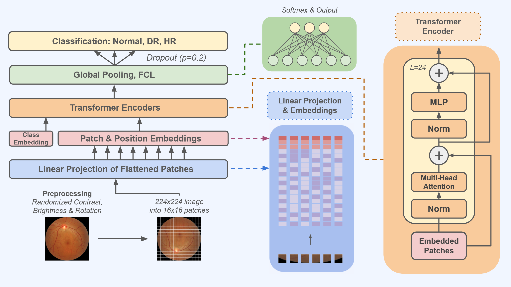

# RetinFormer
RetinFormer is a Vision-Transformer based Retinopathy detection framework. It uses the RETFound foundation model as the baseline and is finetuned on 3 public Fundus datasets. 

Presented at [ICBET 2025](https://www.icbet.org) and the [Katz School 2025 Research Symposium](https://www.yu.edu/katz/research-symposium-2025). 

[Paper](https://www.researchgate.net/publication/401032675_RetinFormer_Augmented_Vision_Transformer_based_Diabetic_and_Hypertensive_Retinopathy_Classification)

## Model Architecture

## Results
| Model | Accuracy | Precision | F-1 | AUC |
| :--- | :---: | :---: | :---: | :---: |
| HDREfficientNet | 0.8963 | 0.8983 | 0.8973 | 0.9548 |
| ViTAEv2 | 0.9018 | 0.9013 | 0.9015 | 0.9646 |
| ViT_b_16 | 0.9127 | 0.9168 | 0.9147 | 0.9847 |
| ViT_b_32 | 0.9147 | 0.9165 | 0.9156 | 0.9814 |
| ViT_l_32 | 0.9167 | 0.9165 | 0.9166 | 0.9784 |
| **RetinFormer** | **0.9271** | **0.9270** | **0.9270** | **0.9866** |
